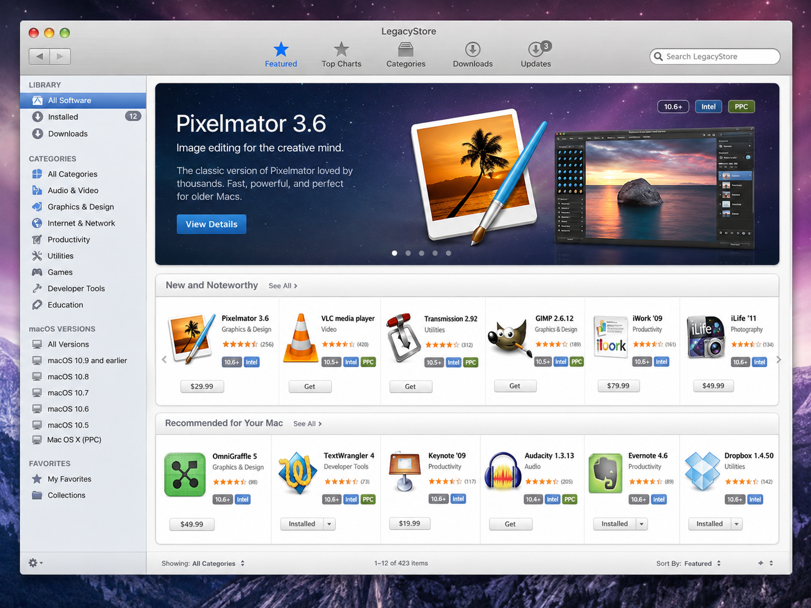

# LegacyStore



LegacyStore - каталог и загрузчик программ для старых Intel Mac с Mac OS X 10.5 до macOS 10.15. Проект подбирает совместимые версии приложений на серверной стороне, чтобы legacy-клиент получал компактные ответы и не выполнял тяжелую фильтрацию локально.

## Краткая информация

Проект состоит из Go backend, PostgreSQL базы данных, web-клиента для каталога и будущего нативного Objective-C/AppKit клиента для старых macOS. Текущая итерация содержит backend для публичного каталога, compatibility engine, seed data, API test script и static web client.

## Возможности

- REST API с версией `/api/v1`.
- Public REST endpoints:
  - `GET /api/v1/bootstrap`;
  - `GET /api/v1/categories`;
  - `GET /api/v1/apps`;
  - `GET /api/v1/apps/{slug}`;
  - `GET /api/v1/apps/{slug}/versions`;
  - `GET /api/v1/apps/{slug}/reviews`;
  - `GET /api/v1/search`;
  - `GET /api/v1/download/{artifact_id}`.
- Compatibility engine для подбора recommended artifact.
- Account/auth API: регистрация, login/logout, cookie sessions, роли,
  профиль, optional TOTP 2FA enable/disable, app-specific legacy passwords и
  device list.
- Reviews/ratings API с лайками и replies.
- Admin/moderation API для пользователей, ролей, приложений, moderation queue и
  audit log.
- PostgreSQL schema migrations.
- Seed data для категорий, приложений, версий и artifacts.
- Docker Compose окружение для локальной разработки.
- Static web client в стиле OS X Mavericks-era App Store.
- Заготовка для legacy client.
- Скрипты для сборки, запуска, миграций, seed data и API tests.

Objective-C client skeleton будет добавляться отдельной задачей.

## Поддерживаемые системы

Legacy-клиент должен поддерживать Intel Mac:

- Mac OS X 10.5 Leopard;
- Mac OS X 10.6 Snow Leopard;
- OS X 10.7 through OS X 10.11;
- macOS 10.12 through macOS 10.15.

Целевые архитектуры клиента: `i386` и `x86_64`. PPC и Apple Silicon не входят в
первую версию проекта.

## Установка зависимостей и тулчейна

Для backend и локального окружения нужны:

- Docker и Docker Compose;
- Go и `psql` запускаются внутри backend container, локально на основной машине
  они не требуются;
- `curl` и `jq` нужны для API test script;
- Xcode с поддержкой старого macOS toolchain понадобится для будущей сборки
  legacy-клиента.

Backend не использует Node.js. Legacy-клиент не должен использовать Swift,
SwiftUI, Storyboards или ARC как обязательную зависимость.

## Настройка окружения

Создайте локальный `.env` из примера:

```sh
cp .env.example .env
```

Значения по умолчанию подходят для локального запуска. Для production секреты из
`.env.example` использовать нельзя.

## Запуск backend и web UI через Docker Compose

```sh
make dev-up
```

После запуска:

- backend: `http://localhost:8080`;
- bootstrap: `http://localhost:8080/api/v1/bootstrap`;
- web client: `http://localhost:8081`;
- web client HTTPS: `https://localhost:8443`.

Авторизация работает только через HTTPS endpoint. Для локальной разработки
`make dev-up` генерирует self-signed certificate для `localhost` в
`admin-web/certs`.

Остановить окружение:

```sh
make dev-down
```

## Миграции и тестовые данные

Запустить migrations:

```sh
make migrate
```

Загрузить seed data:

```sh
make seed
```

Локальный seed создаёт development admin:

- email: `admin@legacystore.local`
- password: `admin12345`

Эти данные предназначены только для локальной разработки.

## Сборка клиента

Objective-C/AppKit client skeleton будет добавлен отдельной задачей. Текущий
скрипт проверяет базовые параметры и явно завершится ошибкой, если Xcode project
еще отсутствует:

```sh
make client
```

Скрипт не должен молча удалять `i386` или повышать deployment target выше 10.5.

## Сборка backend и web UI

Backend:

```sh
make backend
```

Сборка backend выполняет `gofmt`, `go test` и `go build` внутри Docker/backend
container и кладет бинарь в `./build/legacystore-backend`.

Web UI:

```sh
make web
```

## Тестирование

Backend unit tests:

```sh
make test-backend
```

Запустить curl/jq API test script:

```sh
make test-api
```

## Основные команды Makefile

| Команда | Назначение |
|---|---|
| `make dev-up` | Запустить Docker окружение |
| `make dev-down` | Остановить Docker окружение |
| `make backend` | Собрать backend |
| `make web` | Собрать static web UI |
| `make client` | Собрать macOS клиент, когда skeleton будет добавлен |
| `make migrate` | Запустить PostgreSQL migrations |
| `make seed` | Загрузить seed data |
| `make test-api` | Запустить curl/jq API tests |
| `make test-backend` | Запустить backend unit tests |
| `make clean` | Удалить build artifacts |

## Безопасность

Legacy-клиент не должен получать или отправлять основной пароль аккаунта.
Допускаются только app-specific legacy passwords и только через рабочий HTTPS/TLS.
Если TLS validation fails, authentication must be blocked.

Uploads разрешены только через HTTPS web UI. Legacy-клиент не должен загружать
software artifacts. Hash mismatch не должен автоматически удалять скачанный файл,
и скачанные файлы не должны auto-open после download.

## Статус проекта

Текущий статус: backend public catalog MVP и static web client. Реализованы
структура проекта, Docker Compose, Go backend, PostgreSQL migrations,
compatibility engine, seed data, curl/jq API tests и web UI для
каталога, категорий, поиска, app detail, auth/account flows, reviews,
ratings, legacy passwords, admin/moderation screens. Objective-C client
skeleton, uploads, OAuth, P2P и CDN еще не реализованы.
